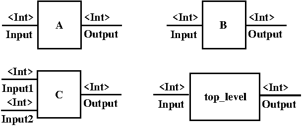

# IML to Lustre Generator: Input
The Lustre generator of HERMES takes in a program described in IML. The following is an example package defining a hierarchical system. 

    01  package agree.example;
    02  import iml.systems.*;
    03  import iml.software.*;
    04  import iml.synchdf.ontological.*;
    05  import iml.contracts.*;
     
    06   trait ATrait refines(Synchronous, Component, Contract, System) {
    07      Input: InDataPort<Int>;
    08      Output: OutDataPort<Int>;
    09      [Assume{comment="A input domain"}] REQ1 : Bool := Input.data < 20;
    10      [Guarantee{comment="A output range"}] REQ2 : Bool := Output.data < 2 * Input.data;
    11      assumption: Bool := REQ1;
    12      guarantee: Bool := REQ2;	
    13  };
    14  type A exhibits(ATrait);
    
    15  trait BTrait refines(Synchronous, Component, Contract, System) {
	16      Input: InDataPort<Int>;
	17      Output: OutDataPort<Int>;
	18      [Assume{comment="B input domain"}] REQ1 : Bool := Input.data < 20;
    19      [Guarantee{comment="B output range"}] REQ2 : Bool := Output.data < Input.data + 15;
	20      assumption: Bool := REQ1;
	21      guarantee: Bool := REQ2;	
    22  };
    23  type B exhibits(BTrait);

    24  trait CTrait refines(Synchronous, Component, Contract, System) {
	25      Input1: InDataPort<Int>;
	26      Input2: InDataPort<Int>;
	27      Output: OutDataPort<Int>;
	28      [Guarantee{comment="C output range"}] REQ1 : Bool := Output.data = Input1.data + Input2.data;
	29      guarantee: Bool := REQ1;	
    30  };
    31  type C exhibits(CTrait);
    
    32  trait top_levelTrait refines(Synchronous, Component, Contract, System) {
    33      Input: InDataPort<Int>;
    34      Output: OutDataPort<Int>;
    35      [Assume{comment="System input domain"}] REQ1 : Bool := Input.data < 10;
    36      [Guarantee{comment="System output range"}] REQ2 : Bool := Output.data < 50;
    37      assumption: Bool := REQ1;
    38      guarantee: Bool := REQ2;		
    39  };
    40  type top_level exhibits(top_levelTrait);
    
    41  type top_level_dot_Impl exhibits(top_levelTrait, Implements<top_level>){
    42      A_sub : A;
    43      B_sub : B;
    44      C_sub : C;
    45      IN_TO_A : Connector<InDataPort<Int>, InDataPort<Int>> := connect<InDataPort<Int>, InDataPort<Int>>(Input, A_sub.Input);
    46      assert{Input.data = A_sub.Input.data};
    47      A_TO_B : Connector<OutDataPort<Int>, InDataPort<Int>> := connect<OutDataPort<Int>, InDataPort<Int>>(A_sub.Output, B_sub.Input);
    48      assert{A_sub.Output.data = B_sub.Input.data};
    49      A_TO_C : Connector<OutDataPort<Int>, InDataPort<Int>> := connect<OutDataPort<Int>, InDataPort<Int>>(A_sub.Output, C_sub.Input1);
    50      assert{A_sub.Output.data = C_sub.Input1.data};
    51      B_TO_C : Connector<OutDataPort<Int>, InDataPort<Int>> := connect<OutDataPort<Int>, InDataPort<Int>>(B_sub.Output, C_sub.Input2);
    52      assert{B_sub.Output.data = C_sub.Input2.data};
    53      C_TO_Output : Connector<OutDataPort<Int>, OutDataPort<Int>> := connect<OutDataPort<Int>, OutDataPort<Int>>(C_sub.Output, Output);
    54      assert{C_sub.Output.data = Output.data};
    55  };

Similar to the Java programming language, the package `package agree.example` is declared at the beginning of the program. 
Then those relevant packages that are needed are imported. In this example, four library packages (`iml.systems`, `iml.software`, `iml.synchdf.ontological` and `iml.contracts`) are imported. 

An IML `Model` consists of its own package name, zero or more imports of type `Import` and zero or more symbols of type `Symbol`. 
Similar to the Java programming language, an IML `Import` is introduced by keyword `import`. 
An IML `Symbol` can be a `SymbolDeclaration`, a `NamedType`, an `Annotation`, a `Trait`, a `dataType` or an `Assertion`. 
A `SymbolDeclaration` can be a template with type parameters and its property list is optional. 
A `NameType`, `Datatype` or `Trait` can be a template with type parameters. 
They are introduced respectively by the keyword `type`, `datatype` and `trait`, followed by an optional property list, name identifier, template information for templates, zero or more relations of `Relation`. 
Its main body, enclosed by `{` and `}`, includes zero or more symbols of `SymbolDeclaration` and `Assertion`. 
An `Assertion` is introduced by the keyword `assert`, followed by an optional property list, an optional comment, an optional identifier and a definition. 
A `Relation` can be an `Inclusion` (introduced by the keyword `includes`), a `Refinement` (introduced by the keyword `refines`), an `Alias` (introduced by the keyword `is`) or a `TraitExhibition` (introduced by the keyword `exhibits`).  

There are four traits (`ATrait`, `BTrait`, `CTrait` and `top_levelTrait`) in the above example. 
All of them refine `Synchronous`, `Component`, `Contract` and `System`, which are respectively traits defined in packages `iml.synchdf.ontological`, `iml.systems`, `iml.contracts` and `iml.systems`. 
In their bodies, the communication interfaces are first defined via `SymbolDeclaration`. 
All their input ports are template type `InDataPort<DataType>`, as defined in package `iml.systems`, with template parameter to be `Int`. 
Similarly, all their output ports are template type `OutDataPort<DataType>` with template parameter to be `Int`. 
A `SymbolDeclaration`, preceded with a property list with annotation `Assume` as defined in package `iml.contracts`, introduces a variable of type `Bool` to specify the required legitimate domain of an input. 
Similarly, a `SymbolDeclaration`, preceded with a property list with annotation `Guarantee` as defined in package `iml.contracts`, introduces a variable of type `Bool` to specify the required legitimate range of an output. 
Lastly, the `assumption` and `guarantee` inherited from `trait Contract` are initialized as the corresponding variables introduced above. 

Four types (`A`, `B`, `C` and `top_level`) are defined via the respective `exhibits` relation. The above figure shows the schematics of the types of the corresponding example. 

The above figure shows the hierarchical composition information of system `top_level_dot_Impl`. 

The library packages `iml.contracts`, `iml.systems` and `iml.synchdf.ontological` are imported in the above example. 
Package `iml.contracts` defines trait `Contract` and annotations `Assume` and `Guarantee`. 
Package `iml.systems` provides library elements to support communication between components. 
Package `iml.synchdf.ontological` provides library elements particularly for synchronous dataflow systems. 
Please refer to the respective library files for details. 