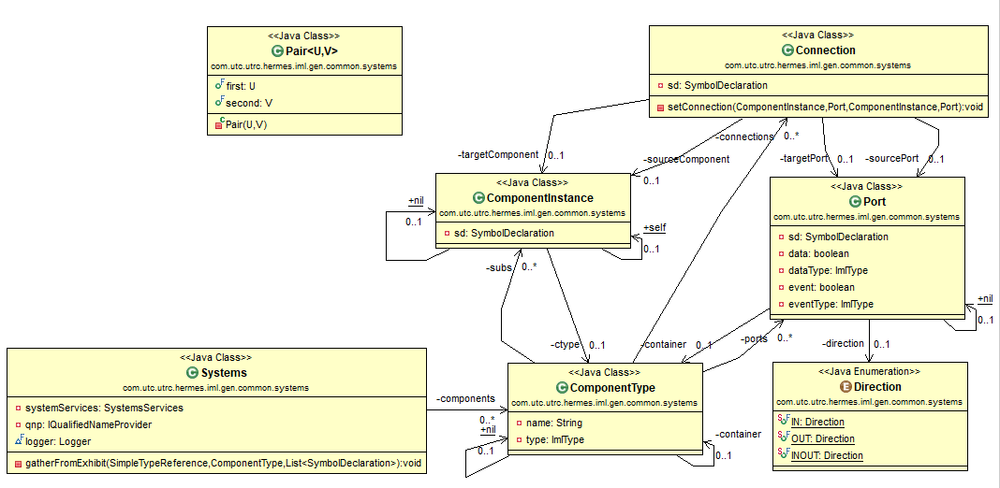

# IML to Lustre Generator: Introduction

The Lustre generator class `LustreGenerator` is defined in the following package:
 
    package com.utc.utrc.hermes.iml.gen.lustre.df.generator;

Programs described in IML are first read, parsed and stored in an in-memory model of type `Model`. 
A new object of type `Systems` is constructed. The class `Systems` is defined in the following package:

    package com.utc.utrc.hermes.iml.gen.common.systems;

Type `Systems` maintains an internal data structure that maps from string identifiers to objects of `ComponentType`. 
Class `ComponentType` maintains the following private fields;  
- `name`, type of `String`, denotes the name of `ComponentType`.
- `subs`, type of `Map<String, ComponentInstance>`, stores the composed sub-components.
- `connections`, type of `Map<String, Connection> connections`, stores its connections. 
- `ports`, type of `Map<String, Port>`, stores its communication ports. 
- `type`, type of `ImlType`, records its corresponding IML type. 

Type `ComponentInstance` maintains the following private fields:
- `sd`, type of `SymbolDeclaration`, records its corresponding symbol of type of `SymbolDeclaration`. 
- `ctype`, type of `ComponentType`, records this component instance's corresponding `ComponentType`. 

Type `Connection` maintains the following private fields;  
- `sd`, type of `SymbolDeclaration`, stores its corresponding IML symbol. 
- `sourceComponent` and `targetComponent`, type of `ComponentInstance`, denotes the source component instance and target component instance of the connection, respectively. 
- `sourcePort` and `targetPort`, type of `Port`, denotes the source port and target port of the connection, respectively.

Type `Port` maintains the following private fields;  
- `sd`, type of `SymbolDeclaration`, stores its corresponding IML symbol. 
- `direction`, type of `Direction`, denotes whether the port is `IN`, `OUT` or `INOUT`. 
- `data` and `event`, type of `boolean`, indicates whether it is a data port and even port, respectively. 
- `dataType` and `eventType`, type of `ImlType`, denotes its corresponding ImlType of data and event, respectively. 

Type `Direction` is an `enum` of three values: `IN`, `OUT`, and `INOUT`, which respectively denotes a port is an input port, an output port, and both an input and output port, respectively. 

The class `SynchDf` is defined in the following package:

    package com.utc.utrc.hermes.iml.gen.lustre.df;

Type `SynchDf` maintains the following private fields:
- `sys`, type of `Systems`, records all components, qualified name provider, etc. 
- `nodes`, type of `Map<String, Node>`, stores the information of nodes in the context of Lustre. 
- `otherTypes`, type of `Map<String, ImlType>`

The class `Node` is defined in the following package:

    package com.utc.utrc.hermes.iml.gen.lustre.df;

Type `Node` maintains the following private fields:
- `nodeType`, type of `SimpleTypeReference`, records its corresponding IML type reference. 
- `lets`, type of `Map<String, FolFormula>`, records the assignment constraints of the `let` body. 
- `component`, type of `boolean`, indicate whether it is exhibits or refines trait `Component`. 
- `ctype`, type of `ComponentType`, records its corresponding IML type. 

The class `LustreModel` is defined in the following package:

    package com.utc.utrc.hermes.iml.gen.lustre.df.model;

Type `LustreModel` maintains the following private fields:
- `nodes`, type of `Map<String, LustreNode>`, denotes all nodes of a Lustre model. 
- `last_id`, type of `int`, used for unique identifier generation. 

The class `LustreType` is defined in the same package. It maintains the following private fields:
- `name`, type of `String`, denotes the name of Lustre type.
- `is_enum` and `is_struct`, type of `boolean`, denotes it is an enumeration type and record type, respectively.  
- `literals`, type of `List<String>`, denotes all enum values if it is enumeration type. 
- `fields`, type of `Map<String, LustreSymbol>`, records its Lustre symbols. 

The class `LustreTypeInstance` is defined in the same package. It maintains the following private fields:
- `type`, type of `LustreNode`, records its corresponding Lustre node. 
- `params` and `outParams`, type of `List<LustreVariable>`, denotes the input arguments and output arguments, respectively. 

The class `LustreNode` is defined in the same package. It is a sub-class of `LustreType` and maintains the following additional private fields:
- `parameters` and `returns`, type of `List<LustreSymbol>`, denotes the input arguments and output arguments, respectively. 
- `variables`,`components`, and `lets`, type of `Map<String, LustreSymbol>`, denotes variables, components, and lets of Lustre symbols, respectively. 

The class `LustreSymbol` is defined in the same package. It maintains the following private fields:
- `elementType`, type of `LustreElementType`, denotes what element type it is. 
- `name` and `definition`, type of `String`, denotes the symbol's name. 
- `type`, type of `LustreTypeInstance`, denotes its corresponding LustreTypeInstance. 
- `parameters`, type of `List<LustreVariable>`, denotes its list of parameters. 
- `isAssume` and `isGuarantee`, type of `boolean`, denotes that it is an assumption and a guarantee, respectively. 

The class `LustreVariable` is defined in the same package. It maintains the following private fields:
- `name`, type of `String`, denotes its name. 
- `type, type of `LustreTypeInstance`, denotes its corresponding LustreTypeIntance. 
- `definition`, type of `FolFormula`, denotes its definition in first-order logic format. 

The class `LustreConstraint` is defined in the same package. It maintains the following private fields:
- `f`, type of `FolFormula`, denotes its first-order formula constraint. 

Type `LustreElementType` is an `enum` of seven values: `PARAMETER`, `RETURN`, `VAR`, `COMPONENT`, `LET`, `FIELD`, `ASSERTION`.
