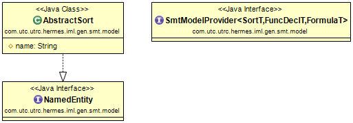
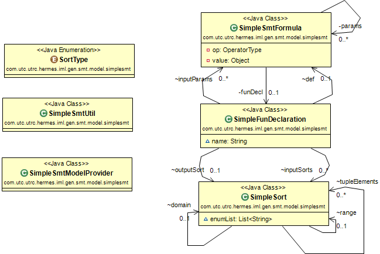
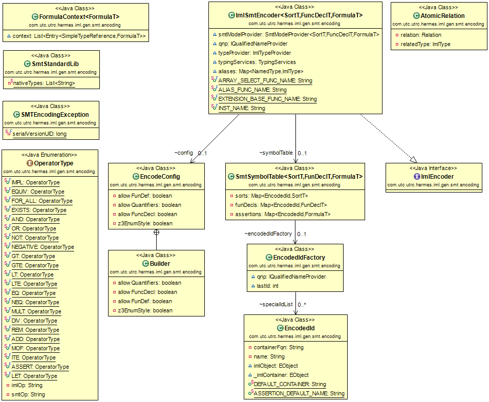

# IML to SMT Generator: Introduction

The SMT Generator has several entry points corresponding to encoding services:

- Encoding of an IML model, which includes all symbols of the model. 
- Encoding of a symbol, which includes constrained type (or simply referred as type) and symbol declaration which has a name and an associate type (or simply referred as type instance).
- Encoding of a formula, which is the usual first order logic formula, including negation, conjunction, disjunction, implications and quantification.
- Encoding of a term, which includes arithmetic terms, term selection and accesses to arrays, tuples and records.

The way of the encoding is to build a table of types that maps IML types to SMT sorts, a table of functions that maps IML symbols to SMT function declarations of function definitions and a table of assertions that maps IML constraints to SMT formulae. 
The SMT encoding can further contain annotations that refer to the role of the sorts and functions in the IML model. 
As shown later in the class diagrams, we denote the table of types with `sorts`, the table of functions with `funDecls` and the table of assertions with `assertions`.

The encoding algorithm works in two passes as described below. 

1. Encoding types

    The first pass adds entries into the table of `sorts`. 
    It identifies a finite set of types that is sufficient for encoding a given `NamedType`. 
    Procedure `defineTypes(T : NamedType)` accepts a named type as input and adds all necessary types to `sorts` to encode `T`:

    1. If `T` already corresponds to a key of the map `sorts`, then skip this procedure.
    2. Create the SMT sort corresponding to `T` and store it in `sorts`.
    3. For each type `U` in relations of `T`, call `defineTypes(U)`.
    4. For each symbol `S` in symbols of `T`, call `defineTypes(type(S))`, where `type(S)` returns the type of the symbol declaration `S`.

    Assume that procedure `defineTypes(U : ImlType)` processes types that have been created using type constructors. It works as follows:

    1. If `U` already corresponds to a key of the map `sorts`, then skip this procedure.
    2. If `U` is of the form `T<U1, ..., Un>`, i.e., template type with concrete arguments, first call `defineTypes(Ui)` for all `i = 1, ..., n`. Then define the new sort for `U` and store it in `sorts`.
    3. If `U` is of the form `U'[N1, ..., Nm]`, i.e., `ArrayType`, first create a new type `curDim` for each dimension, define the new sort for `curDim`, and store it in `sorts`. Then call `defineTypes(U')`.  
    4. If `U` is of the form `(U1, ..., Un)`, i.e., `TupleType`, first call `defineTypes(Ui)` for all `i = 1, ..., n`. Then define the new sort for the `TupleType` and store it in `sorts`.
    5. if `U` is of the form `U1 -> U2`, i.e., function type, then call `defineTypes(U1)` and `defineTypes(U2)`. 

2. Encoding symbols (including functions and formulae)

    The second pass adds entries into the tables of `funDecls` and `assertions`. 
    Procedure `declareFuncs(U: ImlType)` creates all necessary function declarations and formulae for all sorts that have have already been defined. 
    
    1. If `U` is an instance of `NamedType` 
        1. Create functions for non-polymorphic and non-assertion symbols and store them in `funDecls`. This enables shadowing. 
        2. Create formulae for assertion symbols and store them in `assertions`.
        3. For each type `T` in relations of `U`
            1. If relation is an instance of `Alias`, create function declaration for the alias and store it in `funDecls`.
            2. If relation is an instance of `Inclusion`, create function declaration for the extension and store it in `funDecls`.
            3. If relation is an instance of `TraitExhibition`, call `declareFuncs(T)`. 
    2. If `U` is an instance of `ArrayType`, create an array select function and store it in `funDecls`. 
    3. If `U` is an instance of `SimpleTypeReference` with bindings, call `declareFuncs(U')`, where `U'` is the realized type after binding.  

    A recursive procedure `encodeFormula(FolFormula f, TypingEnvironment evn, FormulaT inst, List<SymbolDeclaration> scope)` is used by `declareFuncs(U: ImlType)` to encode first-order logic formulae, where `env` of `TypingEnvironment` captures all type binding information, `FormulaT` is the model class for SMT formula declaration, and `scope` captures all symbol declarations in scope. 
    It recursively parses the structure of the formula and eventually invokes the formula utilities provided by the `SimpleSmtModelProvider` class. The utility functions invokes appropriate constructors of the `SimpleSmtFormula` class. 

The following describes the class diagrams of the SMT encoding packages. A couple of basic class and interface are defined in the following package:

    package com.utc.utrc.hermes.iml.gen.smt.model;

The above figure shows the class diagram of the package. 
Class `AbstractSort` maintains a protected field named `name`. 
It implements the method `getName()` of its interface `NamedEntity`. 
It further implements the API `setName(String name)`. 
The parametric interface `SmtModelProvider` defines APIs for creation of sort, function, constant and enum for an SMT model.   

Classes of a simple SMT model are defined in the following package:

    package com.utc.utrc.hermes.iml.gen.smt.model.simplesmt;

The following figure shows the class diagrams of the package.

`SortType` defines an empty enumeration. 
Class `SimpleSmtUtil` provides utility function `getQuotedName(String name)`, which returns a string with empty space removed and with `<`, `>` and `,` replaced by `_`  in `name`. 
Class `SimpleSmtModelProvider` is a simple implementation of interface `SmtModelProvider` declared in package `com.utc.utrc.hermes.iml.gen.smt.model` using simple SMT model. 

Class `SimpleSort` extends `AbstractSort` defined in package `com.utc.utrc.hermes.iml.gen.smt.model`. 
It further maintains the following package-visible fields:  
- `domain`, type of `SimpleSort`, denotes the sort of the domain of a higher order type.
- `range`, type of `SimpleSort` denotes the sort of the range of a higher order type.
- `tupleElements`, type of `List<SimpleSort>`, denotes tuple sort, i.e., the list of sorts corresponding to the elements of a tuple.
- `enumList`, type of `List<String>`, denotes enum sort, i.e., the list of string labels of an enum list.

Class `SimpleFunDeclaration` maintains the following package-visible fields to declare simple functions:
- `name`, type of `String`, denotes the name of a function.
- `inputSorts`, type of `List<SimpleSort>`, denotes the sorts of the types of the input parameters of a function.
- `outputSort`, type of `SimpleSort`, denotes the sort of the return type of a function.
- `def`, type of `SimpleSmtFormula`, denotes the definition of a function.
- `inputParams`, type of `List<SimpleSmtFormula>`, denotes the arguments of a function. 

Class `SimpleSmtFormula` maintains the following private fields to represent SMT formulae:  
- `funDecl`, type of `SimpleFunDeclaration`, if defined, encodes the SMT formula together with `params`. 
- `op`, type of `OperatorType`, if defined, encodes the SMT formula together with `params`.
- `params`, type of `List<SimpleSmtFormula>`, if not empty, partially or completely defines the formula.
- `value`, type of `Object`, encodes the formula for undefined `op` and `funDecl` and empty `params`.  

The SMT generator class `ImlSmtEncoder` is defined in the following package:
 
    package com.utc.utrc.hermes.iml.gen.smt.encoding;

The following figure shows the class diagrams of the package. 

Enumeration `OperatorType` defines 22 values of operator types. It maintains the following private fields:
- `imlOp`, type of `String`, denotes the IML representation of the operator.
- `smtOp`, type of `String`, denotes the SMT representation of the operator. 

Class `SMTEncodingException` extends `Exception`. It maintain a static final field `serialVersionUID` of type `long`. 

Class `SmtStandardLib` maintains a private static field `nativeTypes` of type `List<String>` for the three native types (`Int`, `Real` and `Bool`) in both plain names and fully-qualified names. 

Parameterized class `FormulaContext` maintains a package-visible field `context` of type "List<Entry<SimpleTypeReference, FormulaT>>", where `FormulaT` is the parameter of the class. 

Class `AtomicRelation` maintains the following private fields:
- `relation`, type of `Relation`, denotes `Alias`, `Inclusion`, `TraitExhibition` or `Refinement`.
- `relatedType`, type of `ImlType`, denotes the type that is related via `relation`. 

Class `EncodeConfig` maintains four private fields of type `boolean`: `allowFunDef`, `allowQuantifiers`, `allowFuncDecl` and `z3EnumStyle`. 
The nested static class `Builder` of class `EncodeConfig` also maintains the above four fields. 
The configuration is used to generate user-specified SMT format.  

Class `EncodedId` encodes IML types so that each unique type has a unique ID. It maintains the following fields:
- `containerFqn`, type of `String`, denotes the container's fully-qualified name. 
- `name`, type of `String`, denotes the name of `imlObject`.
- `imlObject`, type of `EObject`, denotes the IML object of the `EncodedId` instance. 
- `_imlContainer`, type of `EObject`, denotes the IML container of `imlObject`.
- `DEFAULT_CONTAINER`, type of `String`, provides a name when processing template types. 
- `ASSERTION_DEFAULT_NAME`, type of `String`, provides part of the name when processing assertions without a name specified. 

The unique encoder IDs are generated based on `imlContainer` or the eContainer of a given `imlObject` if `imlContainer` is undefined.  

Class `EncodedIdFactory` is a pattern class creating `EncodedId` for any IML object. It maintains the following fields:
- `qnp`, injected, type of `IQualifiedNameProvider`, provides qualified names for `EObject`.
- `lastId`, type of `int`, assists in creating unique names.
- `specialIdList`, type of `Map<EObject, EncodedId>`, helps with objects without standard unique names.

Class `SmtSymbolTable`, parameterized with `SortT`, `FunDeclT` and `FormulaT`, stores SMT model and provides access to its symbols and elements. 
It maintains the following four fields:
- `encodedIdFactory`, injected, type of `EncodedIdFactory`, creates `EncodedID` for an `EObject`.
- `sorts`, type of `Map<EncodedId, SortT>`, stores the mapping from `EncodedID` to `SortT` of the SMT model.
- `funDecls`, type of `Map<EncodedId, FunDeclT>`, stores the mapping from `EncodedID` to `FunDeclT` of the SMT model.
- `assertions`, type of `Map<EncodedId, FormulaT>`, stores the mapping from `EncodedID` to `FormulaT` of the SMT model.

Interface `ImlEncoder` abstracts the encoding of any IML objects. It declares five interfaces for encoding five types of IML objects.  

Finally, class `ImlSmtEncoder`, parameterized with `SortT extends AbstractSort`, `FuncDeclT` and `FormulaT`, implements interface `ImlEncoder` for SMT encoding. 
The encoding supports SMT v2.6. Besides four static final string variables, it further maintains the following fields:
- `symbolTable`, injected, type of `SmtSymbolTable<SortT, FuncDeclT, FormulaT>`, stores encoded SMT model.
- `smtModelProvider`, injected, type of `SmtModelProvider<SortT, FuncDeclT, FormulaT>`
- `qnp`, injected, type of `IQualifiedNameProvider`, provides qualified names for `EObject`.
- `typeProvider`, injected, type of `ImlTypeProvider`, provides type inference utilities. 
- `typingServices`, injected, type of `TypingServices`, checks how two types relate, e.g., equality and compatibility. 
- `config`, type of `EncodeConfig`, customizes how encoding is generated. 
- `aliases`, type of `Map<NamedType, ImlType>`, records the mapping information for alias relations.  
  

