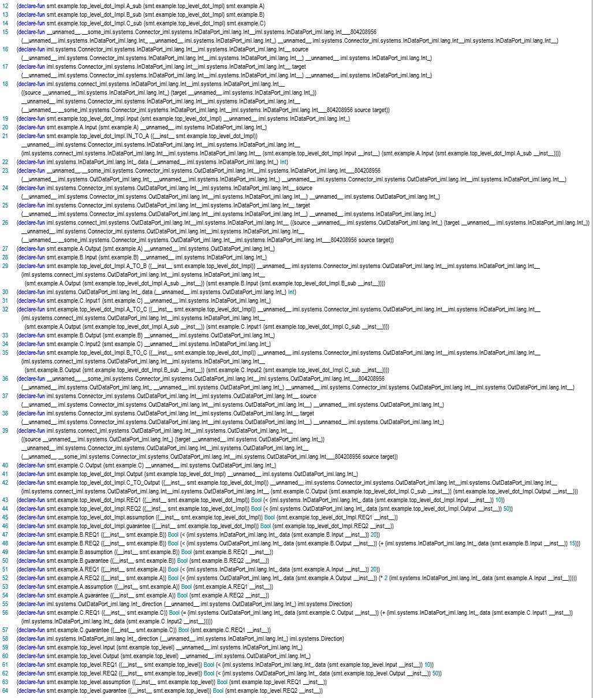
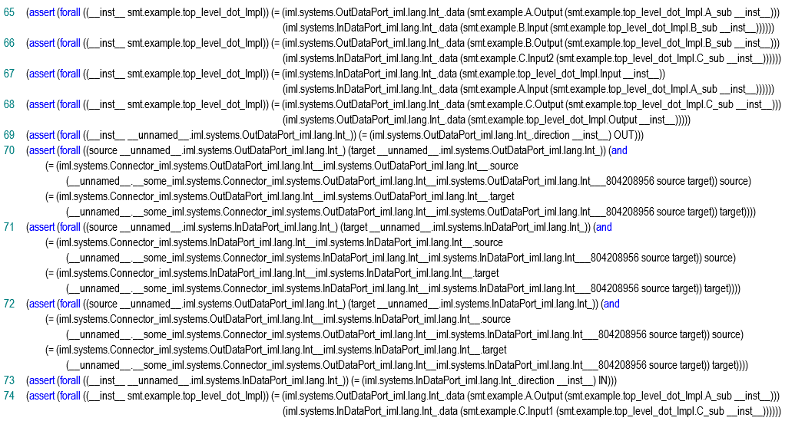

# IML to SMT Generator: Output
The SMT generator of HERMES emits SMT encoding, which mostly conforms to [The SMT-LIB Standard/Language Version 2.6](http://smtlib.cs.uiowa.edu/papers/smt-lib-reference-v2.6-r2017-07-18.pdf). 
Please following the link for details. In the following, we briefly touch upon some basics to facilitate our discussion. 

The SMT-LIB Language consists of theory declarations, logic declarations and scripts. 
The language syntax is similar to that of the LISP Programming Language and an expression of the SMT-LIB Language is a Common-Lisp S-expressions. 
An S-expression is either a non-parenthesis token or a sequence (possibly empty) of S-expressions enclosed in parenthesis. In the SMT-LIB Language, logic expressions are represented with well-sorted terms. 
Besides built-in sorts (e.g. `Bool`, `Int`, `Real`, etc.), new sorts can be introduced as follows:

    (declare-sort s n)
    
The above declaration adds sort symbol `s` with associated arity `n`.

Similarly new functions can be introduced as follows:

    (declare-fun f (σ_1 ··· σ_n) σ)
    
The above declaration adds a new function symbol `f` with associated rank `σ_1 ··· σ_nσ` with `n ≥ 0`. 

Datatypes can be introduced as follows:

    (declare-datatypes ((D_1 k_1) ··· (D_n k_n)) (d_1 ··· d_n))
    
The above declaration brings in `n` algebraic datatypes `D_1, ..., D_n` with respective arities `k_1, ..., k_n` and declarations `d_1, ..., d_n`. 

Note that our SMT-encoding introduces enumeration datatypes `declare-datatypes`. The above format works for solvers like CVC4. 
Unfortunately this format doesn't work for Z3 and we need to use its corresponding required format when targeting the Z3 solver. 

Assertions are added as follows:

    (assert t)

The above command add `t`, a well-sorted term of sort `Bool` to its current assertion level. 

The SMT-LIB Language supports comments in the following style: 

    ; char sequence not contained within a string literal or a quoted symbol starting with ";" and ending with the first subsequent line breaking char

The following code segments are the SMT-encoding for the example shown in Section [IML to SMT Generator: Input](./.gen_smt_input.md.html). 

The above code segment (from Line 01 to 11) illustrates the sorts and datatype generated for the example. 
The `OutDataPort<Int>` type used in Lines 07, 16, 26, 33, 46, 48, 50 and 52 of the example is encoded with the sort introduced in Line 01 of the above code segment. 
The `InDataPort<Int>` type used in Lines 06, 15, 24, 25, 32, 44, 46, 48 and 50 of the example is encoded with the sort introduced in Line 08 of the above code segment. 
The `Connector<InDataPort<Int>, InDataPort<Int>>` type used in Line 44, the `Connector<OutDataPort<Int>, InDataPort<Int>>` type used in Lines 46, 48 and 50, 
and the `Connector<OutDataPort<Int>, OutDataPort<Int>>` type used in Line 52 of the example are respectively encoded with the sorts introduces in Lines 09, 02 and 03 of the above code segment. 
Constrained types `A` (defined in Line 13 of the example), `B` (defined in Line 22 of the example) and `C` (defined in Line 30 of the example) are respectively encoded with the sorts introduced in Lines 06, 05 and 07 of the above code segment. 
The constrained type `top_level` (defined in Line 39 of the example) and `top_level_dot_Impl` (defined in Line 40 of the example) are encoded with the sorts introduced in Lines 11 and 04 of the above code segment, respectively. 
Lastly the enumeration type `Direction` defined in package `iml.systems` is encoded with datatype introduced in Line 10 of the above code segment. 

The above code segment illustrates new function symbols introduced for the example. 
The functions introduced in Lines 12, 13 and 14 of the above code segment respectively encode variables `A_sub`, `B_sub` and `C_sub` in Lines 41-43 in the example.
The functions introduced in Lines 19, 20, 28 and 59 of the above code segment respectively encode variables `Input` of Lines 32, 06, 15 and 32 of the example. 
The functions introduced in Lines 31 and 34 of the above code segment respectively encode variables `Input1` of Line 24 and `Input2` of Line 25 of the example. 
The functions introduced in Lines 27, 33, 40, 41 and 60 of the above code segment respectively encode variables `Output` of Lines 07, 16, 26, 33 and 33 of the example. 
The functions introduced in Lines 43, 44, 47, 48, 51, 52, 56, 61 and 62 respectively encode the requirements of Lines 34, 35, 17, 18, 08, 09, 27, 34 and 35 of the example.
The functions introduced in Lines 45, 46, 49, 50, 53, 54, 57, 63 and 64 respectively encode the assumptions/guarantees of Lines 36, 37, 19, 20, 10, 11, 28, 36 and 37 of the example. 

The functions introduced in Lines 21, 29, 32, 35 and 42 of the above code segment respectively encode variables `IN_TO_A` of Line 44, `A_TO_B` of Line 46, `A_TO_C` of Line 48, `B_TO_C` of Line 50 and `C_TO_Output` of Line 52 of the example. 
The functions introduced in Lines 16 and 17 of the above code segment respectively encode variables `source` and `target` of type `Connector<InDataPort<Int>, InDataPort<Int>>` used in Line 44 of the example.
The functions introduced in Lines 24 and 25 of the above code segment respectively encode variables `source` and `target` of type `Connector<OutDataPort<Int>, InDataPort<Int>>` used in Lines 44, 48 and 50 of the example.
The functions introduced in Lines 37 and 38 of the above code segment respectively encode variables `source` and `target` of type `Connector<OutDataPort<Int>, OutDataPort<Int>>` used in Line 52 of the example.
The functions introduced in Lines 18, 26 and 39 of the above code segment respectively encode `connect<InDataPort<Int>, InDataPort<Int>>` (in Line 44 of the example), `connect<OutDataPort<Int>, InDataPort<Int>>` (in Lines 46, 48 and 50) and `connect<OutDataPort<Int>, OutDataPort<Int>>` (in Line 52 of the example), whose `some` constructors are respectively encoded by the functions introduced in Lines 15, 23 and 36 of the above code segment.
The functions introduced in Lines 22 and 30 of the above code segment respectively encode variables `data` of the instantiation of types `InDataPort<DataType>` and `OutDataPort<DataType>` exhibiting trait `DataCarrier<DataType>` with `DataType` to be `Int` as defined in package `iml.systms`. 
The functions introduced in Lines 55 and 58 of the above code segment respectively encode variables `direction` of the instantiation of type `OutDataPort<DataType>` and `InDataPort<DataType>` exhibiting trait `Port` with `DataType` to be `Int` as defined in package `iml.systems`. 

The above code segment illustrate the assertion section generated for the example. 
The asserts of Lines 65, 66, 67, 68 and 74 enforce the data along the connections stay unchanged, which respectively correspond to Lines 47, 51, 45, 53 and 49. 
The asserts of Lines 69 and 73 respectively enforce the directions of `OutPort` and `InPort`, as prescribed for traits `Out` and `In` in package `iml.systems`. 
The asserts of Lines 70, 71 and 72 enforce that the respective `source` and `target` are equal to their counterpart when two connectors are connected via `connect`.  

Notice that fully-qualified names are used to guarantee unique identifiers in the encoding. 
